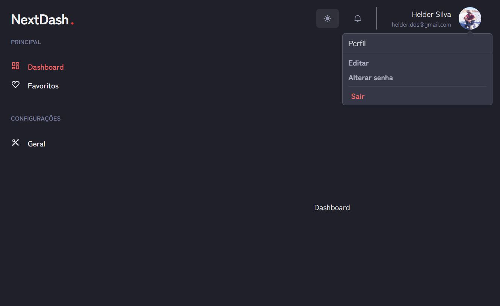

# dashboard-nextjs-chakraui-firebase

First, config the environment on `.env.local` with your firebase configs:

```bash
NEXT_PUBLIC_FIREBASE_PUBLIC_API_KEY=
NEXT_PUBLIC_FIREBASE_AUTH_DOMAIN=
NEXT_PUBLIC_FIREBASE_PROJECT_ID=
NEXT_PUBLIC_FIREBASE_STORAGE_BUCKET=
NEXT_PUBLIC_FIREBASE_APP_ID=

```

install dependencies:
```bash
npm install
# or
yarn
```

Then, run it:
```bash
npm run dev
# or
yarn dev
```

## Screenshots

### Login


### Main


### Profile edit
